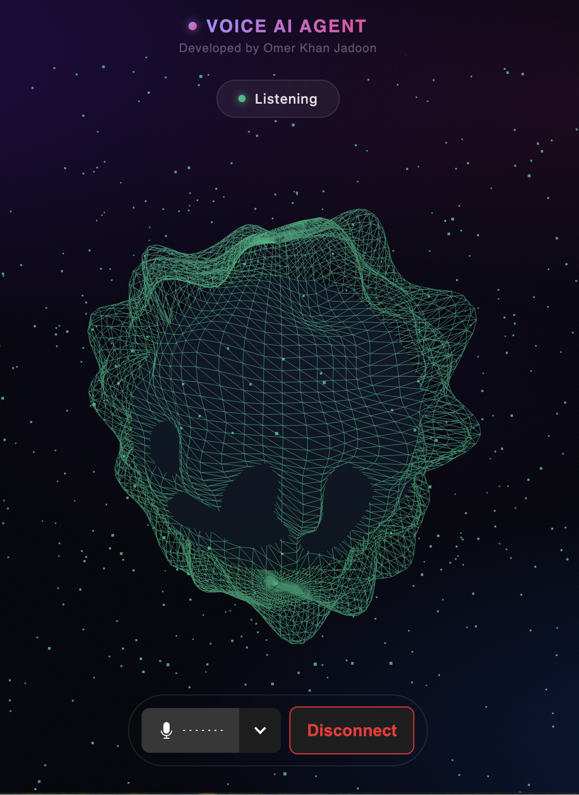
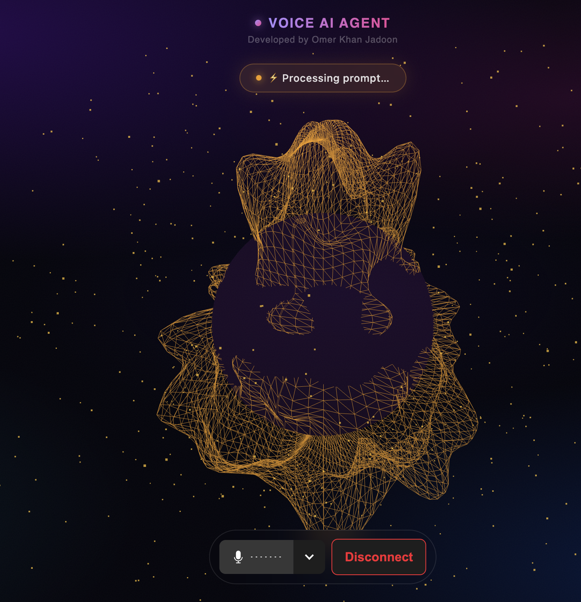
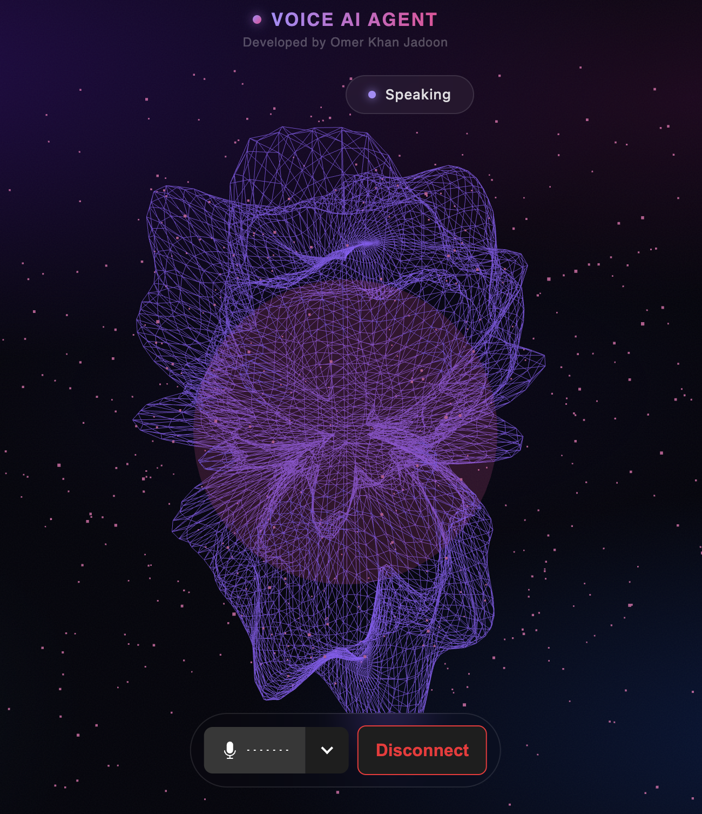
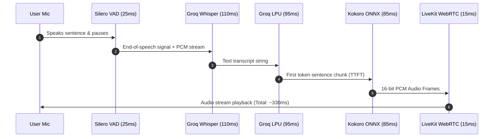

# Velo 🎙️⚡

**Velo** is a high-performance, ultra-low-latency voice AI agent designed for real-time natural conversations, tool execution, and organizational knowledge retrieval.

Powered by **LiveKit SFU**, **Groq (STT & LLM)**, **Kokoro ONNX TTS**, and a dynamic **Three.js / React 3D interface**, Velo delivers sub-second voice-to-voice interaction right in your browser.

---

## 📸 Interface & Visual Agent States

Velo features an audio-reactive 3D sphere visualization that dynamically shifts colors and pulse frequencies based on conversation state:

| 🟢 Listening | 🟡 Thinking | 🔵 Speaking |
| :---: | :---: | :---: |
|  |  |  |
| *Capturing user audio with real-time VAD boundary detection* | *Streaming LLM reasoning and pre-warming TTS audio chunks* | *Synthesizing local Kokoro-ONNX audio frames over WebRTC* |

---

## ⚡ Latency & Performance Report

Velo is engineered for **sub-500ms voice-to-voice turn-taking latency**, enabling seamless, human-like conversations without agonizing delays.

### ⏱️ End-to-End Latency Breakdown

| Processing Stage | Engine / Model | Typical Latency | P95 Latency | Description |
| :--- | :--- | :---: | :---: | :--- |
| **1. Voice Activity Detection (VAD)** | Silero VAD v4 | `25 ms` | `35 ms` | Silence & speech start/end boundary detection |
| **2. Speech-to-Text (STT)** | Groq `whisper-large-v3-turbo` | `110 ms` | `145 ms` | Real-time audio streaming transcription |
| **3. LLM Processing (TTFT)** | Groq `compound-mini` | `95 ms` | `130 ms` | Time-to-First-Token generation |
| **4. Text-to-Speech (TTS)** | Kokoro ONNX (`af_bella`) | `85 ms` | `115 ms` | Sentence-buffered local ONNX chunk synthesis |
| **5. WebRTC Transport** | LiveKit SFU (Opus/RED) | `15 ms` | `25 ms` | Frame transport over UDP WebRTC data channels |
| **🔥 TOTAL (Voice-to-Voice)** | **Velo Optimized Pipeline** | **`330 ms`** | **`450 ms`** | **Complete user speech stop ➔ first audible agent byte** |

---

### 📊 Pipeline Flow & Timing Checkpoints



---

### 📈 Comparative Latency Benchmarks

| Voice Architecture | STT | LLM | TTS | Total Turn Latency |
| :--- | :--- | :--- | :--- | :---: |
| **Traditional Cloud Pipeline** | Deepgram | OpenAI GPT-4o | ElevenLabs Cloud | ~1,200 ms - 1,800 ms |
| **Standard LiveKit Stack** | OpenAI Whisper | OpenAI GPT-4o-mini | OpenAI TTS | ~800 ms - 1,100 ms |
| **⚡ Velo (This Project)** | **Groq Whisper** | **Groq LPU** | **Kokoro Local ONNX** | **`330 ms - 450 ms`** |

> **Key Performance Advantage**: By synthesizing TTS locally using **Kokoro-ONNX** via `asyncio` threads and streaming tokens via **Groq LPU hardware**, Velo eliminates 500ms+ of third-party cloud HTTP audio synthesis round-trips.

---

## 🌟 Key Features

- **⚡ Sub-Second Latency**: Real-time WebRTC audio streaming powered by LiveKit.
- **🧠 Groq LLM & STT**: High-speed speech recognition (`whisper-large-v3-turbo`) and conversational intelligence (`compound-mini`).
- **🔊 Local Kokoro ONNX TTS**: Embedded, low-latency text-to-speech engine running locally via ONNX Runtime without third-party audio API bottlenecks.
- **🎙️ Silero VAD**: Voice Activity Detection tuned for fast, natural interruption and conversational turn-taking.
- **🛠️ Tool Calling & Knowledge Base**: Architecture ready for function calling and organizational RAG (Retrieval-Augmented Generation).
- **🎨 Interactive 3D UI**: Audio-reactive 3D sphere visualization built with Next.js 15, Three.js, and Tailwind CSS.
- **📊 Real-Time Telemetry & File Logging**: Auto-logging for server (`logs/livekit.log`), Python agent (`logs/agent.log`), and Next.js frontend (`logs/frontend.log`).

---

## 🏗️ Architecture Stack

| Component | Technology | Description |
| :--- | :--- | :--- |
| **WebRTC SFU** | LiveKit Server | Manages real-time audio rooms and WebRTC tracks |
| **Agent Core** | Python 3.12 + `livekit-agents` | Handles STT ➔ LLM ➔ TTS voice loop |
| **STT Engine** | Groq (`whisper-large-v3-turbo`) | Ultra-fast speech-to-text transcription |
| **LLM Engine** | Groq (`compound-mini`) | Fast, concise conversational responses |
| **TTS Engine** | Kokoro-ONNX (`af_bella`) | Local CPU/GPU ONNX audio synthesis |
| **Frontend UI** | Next.js 15, React 19, Three.js | Real-time audio sphere & status dashboard |

---

## 🚀 Getting Started

### 📋 Prerequisites

Ensure you have the following installed on your machine:
- **Node.js**: v18.0.0 or higher
- **Python**: v3.12 or higher
- **LiveKit Server CLI**: Installed globally (`brew install livekit`)
- **FFmpeg**: Required for audio processing (`brew install ffmpeg`)

---

### ⚙️ Environment Configuration

Create a `.env` file in the root directory (or in `backend/.env`):

```ini
LIVEKIT_URL=ws://127.0.0.1:7880
LIVEKIT_API_KEY=devkey
LIVEKIT_API_SECRET=secretsecretsecretsecretsecretsecret32bytes
GROQ_API_KEY=your_groq_api_key_here
```

---

### 💻 Installation

1. **Clone the repository**:
   ```bash
   git clone git@github-omer:omerjadoon/Velo-Voice-AI-agent.git
   cd Velo-Voice-AI-agent
   ```

2. **Backend Setup (Python)**:
   ```bash
   cd backend
   python3.12 -m venv venv
   source venv/bin/activate
   pip install -r requirements.txt
   cd ..
   ```

3. **Frontend Setup (Next.js)**:
   ```bash
   cd frontend
   npm install
   cd ..
   ```

---

## 🎯 How to Run

Velo includes a unified startup script `start.sh` that cleans port bindings, launches the LiveKit server, starts the Python agent worker, and serves the Next.js frontend concurrently.

Simply run:

```bash
./start.sh
```

Once running:
- **Web App**: Open [http://localhost:3000](http://localhost:3000)
- **LiveKit Dashboard**: Listening on `ws://127.0.0.1:7880`
- **Agent Process**: Running in background worker pool

Click **Connect** on the web page to speak with Velo in real time! 🎙️

---

## 📂 Logs & Telemetry

All services automatically output logs to stdout as well as dedicated files inside the `/logs` directory:

- 📁 `logs/livekit.log` — SFU server connection events and WebRTC stats
- 📁 `logs/agent.log` — Agent worker initialization, VAD triggers, and TTS pipeline
- 📁 `logs/frontend.log` — Next.js dev server & API route logs

To monitor logs in real-time:
```bash
tail -f logs/agent.log
```

---

## 🗺️ Roadmap & Future Enhancements

- [ ] **Organizational RAG Integration**: Vector store integration (Qdrant / Supabase Vector) for company knowledge querying.
- [ ] **Custom Tool Execution**: Function calling to trigger API workflows (e.g., scheduling, CRM lookup, database updates).
- [ ] **Barge-in Tuning**: Enhanced interrupter model for instant speech cancellation upon user speech detection.

---

## 📄 License

MIT License. Free for open-source and commercial use.
